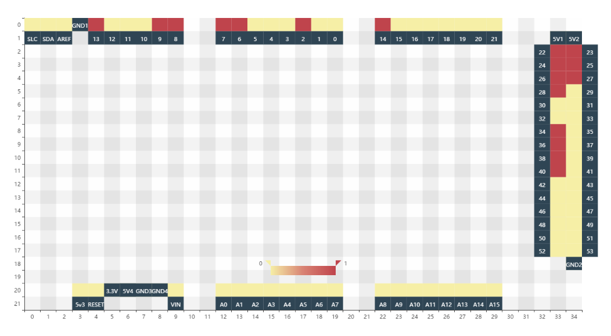

# `Webio2560`

Inspired by [WebIOPi](http://webiopi.trouch.com/), show Mega2560 pins states on the web page.

GUI should looks like:

.

Now the code is extremely small (and possibly a little ugly):

``` vi
src
    │  app.js
    │
    ├─client
    │      pins.html
    │      pins.js
    │
    └─server
            all_pins_value.js
```


[`socket.io`](https://github.com/socketio/socket.io) and [`echarts`](http://echarts.baidu.com/) are the primary libs we use to show the data.

`socket.io` transfer pins value to the front side and `heatmap` of `echarts` is used to show the data.

Oh, I forget [`johnny-five`](http://johnny-five.io/), which provide us the ability to get pins' values.

## Usage

``` vi
$ pwd
# mega2560_pins
$ npm install
$ node src/app.js
```

And open the `src/client/pins.html` (as I said, code is ugly), you should see something like we show before.


## Dive into code

*Personally, I will really appreciate if the author could explain his (or her) code briefly. So there is my comments on the codes.*

### [`app.js`](app.js)

The `app.js` is what we use to setup the node socket.io and get ready to send data to the front end. Code is unreasonably short, modified from [standalone socket.io example](https://github.com/socketio/socket.io#standalone).

All we need is create an `io` object and pass it to the `decorateIOAllPins()` method which will then use `io` to `emit` pin value changes to the front end.

We will show how to use this in your own code latter.

### [`server/all_pins_value.js`](server/all_pins_value.js)

``` js
exports.pin_arr = pin_arr;
exports.monitor_all_pins = monitor_all_pins;
exports.getDecorateIOAllPins = getDecorateIOAllPins;
```

`pin_arr` just `new` pins we what to monitor (ANALOG pins have not been test). We first init all pins as `INPUT` so we can listen to values' change, so, if you want to use this in your own code, **please call `pin_arr` before define pins you want to use**, and redefined (OUPUT) pins will not be monitored.

`monitor_all_pins` will `emit` the addr and value of a pin whenever it's state change. The `on` mechanism (register a handler to be called whenever the board reports desired action) of `johnny-five` make it possibly to write code much more easy.

`getDecorateIOAllPins` wrap call the former two method and send data via `io`.

To use this in your own code, please just modify `decorateIOAllPins` to suit your situation. ~~[An example should be appealing]~~

### [`client/pins.js`](client/pins.js)

Code are modified from [echarts heatmap-cartesian](https://ecomfe.github.io/echarts-examples/public/editor.html?c=heatmap-cartesian). We use two `series` to represent pins' states and pins' numbers respectively.

Pins are mapped into the heatmap, the layout are like the board.

Whenever pin state changed received, we recalculate the data to present in series via `setNewOption()`.(This can be a problem if the change frequency is too high).

### [`client/pins.html`](client/pins.html)

Since we only have one interaction with backend, so I put socket code there. Just call `setNewOption()` when data arrive.